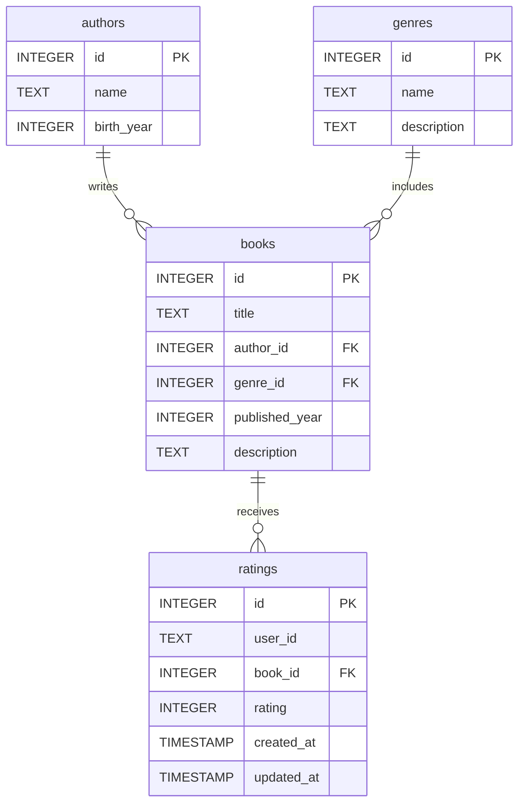

# Svelte Library Demo

This is a demo on how to work with a SQLite database (hosted on Turso) and SvelteKit.

## Database structure

```mermaid
erDiagram
    authors {
        INTEGER id PK
        TEXT name
        INTEGER birth_year
    }

    genres {
        INTEGER id PK
        TEXT name
        TEXT description
    }

    books {
        INTEGER id PK
        TEXT title
        INTEGER author_id FK
        INTEGER genre_id FK
        INTEGER published_year
        TEXT description
    }

    ratings {
        INTEGER id PK
        TEXT user_id
        INTEGER book_id FK
        INTEGER rating
        TIMESTAMP created_at
        TIMESTAMP updated_at
    }

    authors ||--o{ books : writes
    genres ||--o{ books : includes
    books ||--o{ ratings : receives

```

