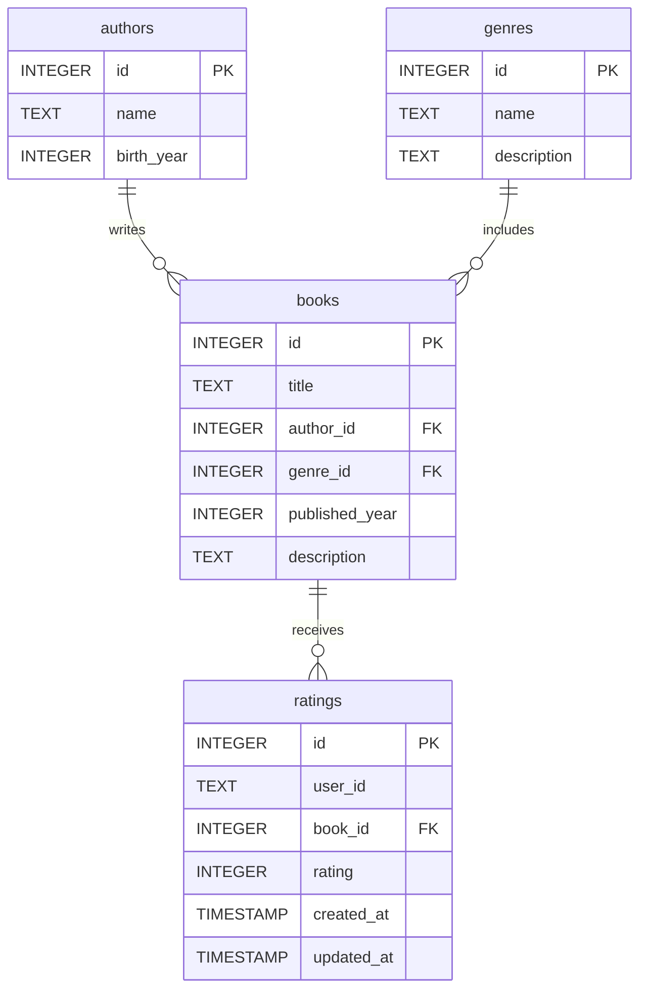

# Svelte Library Demo

This is a demo application showcasing how to work with a SQLite database (hosted on [Turso](https://turso.tech/)) and [SvelteKit](https://svelte.dev/).

## Database Structure

## Features of the App

1. View a list of books.
2. View a list of authors.
3. View a list of genres.
4. Search for books by title or description.
5. View detailed information about a book (title, description, author, genre, year, and ratings).
6. View detailed information about an author (birth year and a list of their books).
7. View detailed information about a genre (description and a list of books in that genre).
8. Rate a book.
9. Update an existing rating.

## Repository Setup

### Prerequisites

- Node.js
- pnpm
- A Turso account

### Steps

1. Create a `.env` file based on `.env.example` and include the connection details for your Turso database.
2. Seed the local database using the command `pnpm seed` (this runs the `seed.sql` script).
3. Install the dependencies by running `pnpm install`.
4. Start the development server with `pnpm dev`.

Note: The `seed.sql` file contains a large number of fake ratings to populate the database for demonstration purposes.
