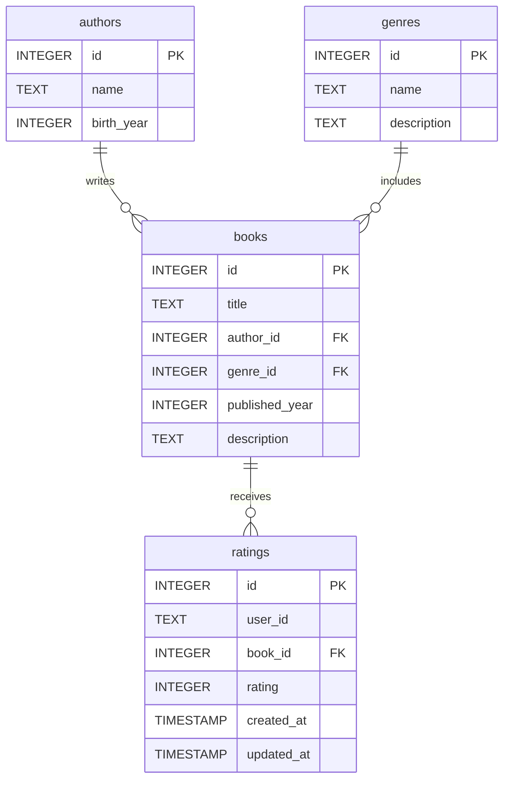

# Svelte Library Demo

This is a demo on how to work with a SQLite database (hosted on Turso) and SvelteKit.

## Database structure

## Features of the app

1. View list of books
2. View list of authors
3. View list of genres
4. Search within books (title and description)
5. View details of a book (title, description, author, genre, year, ratings)
6. View details of an author (birth year, list of their books)
7. View details of a genre (description, list of books within that genre)
8. Rate a book
9. Update a rating
